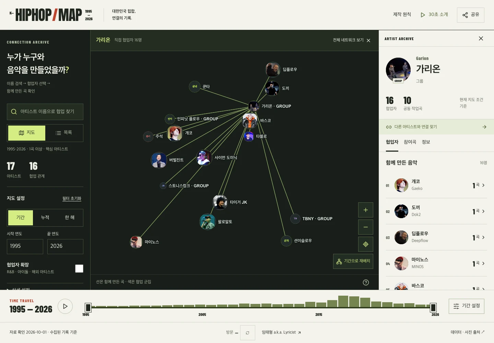
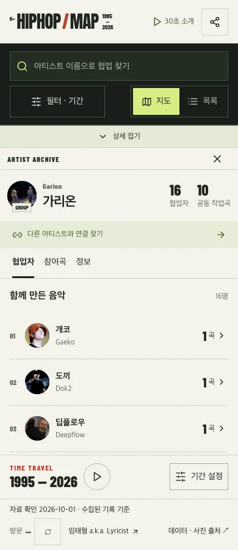
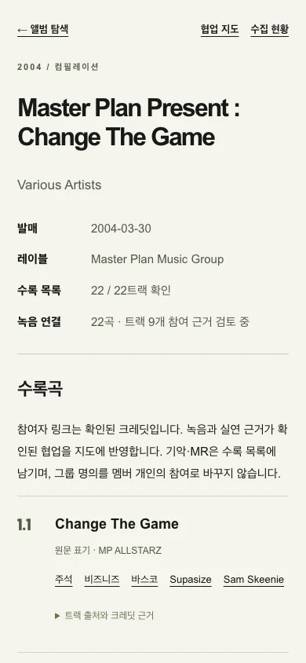
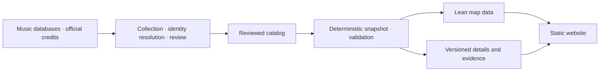

# K-HIPHOP MAP · Korean Hip-Hop Map

[한국어](README.md) · [English](README.en.md)

**Explore Korean hip-hop through the music artists made together.**

A nonprofit web archive of artist collaborations, grounded in recording credits from 1995 through the catalog's collection date.

[Explore the map](https://k-hiphop-map.vercel.app/) · [Browse albums](https://k-hiphop-map.vercel.app/releases/) · [Collection status](https://k-hiphop-map.vercel.app/coverage/) · [Methodology](https://k-hiphop-map.vercel.app/methodology/) · [Credits](https://k-hiphop-map.vercel.app/credits/) · [Suggest a correction](https://github.com/taehyeonglim/k-hiphop-map/issues/new?template=data-correction.yml)

[](https://github.com/taehyeonglim/k-hiphop-map/actions/workflows/verify.yml)



<p align="center"> </p>

These are actual application screenshots. Photograph authors and reuse conditions are listed in the [credits](https://k-hiphop-map.vercel.app/credits/).

The October 4, 2026 follow-up adds all **107 remaining core portraits**: core coverage is **268/268 (100%)**, with **781/2,756 artists** photographed overall. These 107 public profile/interview images have reviewed identities and sources; **individual reuse permission remains unconfirmed** and is explicitly distinguished from licensed images. [New portraits, evidence and reproduction](docs/portrait-expansion.md)

## Things to explore

- **Find an artist's collaborators:** [start with Garion](https://k-hiphop-map.vercel.app/?artist=garion).
- **Explore a period:** [collaborations from 2005–2014](https://k-hiphop-map.vercel.app/?from=2005&to=2014).
- **Connect two artists:** use the path search in an artist's details, then inspect the recordings supporting each step.

- **Find early releases:** [browse Korea, Master Plan, BLEX and other albums](https://k-hiphop-map.vercel.app/releases/) by title, year, type or label, then inspect complete track inventories and credit evidence.
- **Inspect missing material:** [collection status](https://k-hiphop-map.vercel.app/coverage/) records the portrait survey for every catalog artist and outstanding album research.

## How to use it

1. Search by Korean name, English name or alias. Arrow keys and Enter also work.
2. Select a face to show that artist's direct collaborators and ties.
3. Select a tie or the song count beside a collaborator, then expand the credit evidence.
4. Adjust the period, minimum song count or collaborator expansion. Returning to the full network clears selection while preserving filters.
5. Share the current period, artist, path and list state. Browser Back restores the previous selection.

Mobile search remains visible; expand the bottom panel to read details. List view offers the same artist and recording exploration when the graph is unavailable. The 30-second introduction opens only on request and downloads no trailer assets beforehand.

## Reading the map

| Visual | Meaning |
| --- | --- |
| Face size | Number of collaborators during the selected period |
| Tie thickness | Logarithmic count of distinct co-recordings with rap/vocal performance credits |
| Color | Collaboration community, not an actual label or crew |
| Distance | Weighted graph layout, not a score of friendship or musical similarity |

Filters use first-release years. Reissues of the same recording count once. Groups remain separate from individual members; membership never implies an individual performance. Ambiguous identities and performer roles do not create accepted ties. Counts describe **collected evidence**, not the entirety of Korean hip-hop or complete discographies. Released songs and lyrics are not hosted; listening links point to external services.

## Technology and data flow

Next.js static export · React · TypeScript · Sigma/WebGL · Graphology · ForceAtlas2 · weighted Louvain · Vitest · Playwright



The browser loads map data first, then fetches artist and recording evidence on selection. A dataset mismatch prompts a refresh. See [architecture, types and URL behavior](docs/architecture.md).

## Run locally

Requires **Node.js 22+**. The repository includes the reviewed catalog and portraits. Ordinary development needs no Python, API credentials or music-service login.

```sh
npm ci
npm run data:build
npm run dev
```

Open [localhost:3000](http://localhost:3000). Optional settings are documented in [.env.example](.env.example). Collection, portrait processing and trailer regeneration have separate Python requirements.

## Verify, build and deploy

```sh
npm run typecheck
npm test
npm run api:check
python3 scripts/test-collector.py
python3 -m pip install -r requirements.txt
python3 scripts/test-portraits.py
npm run build
npm start -- --listen 3100
# Test the built output in another terminal
PLAYWRIGHT_BASE_URL=http://127.0.0.1:3100 npm run test:e2e
```

The build's prebuild step generates snapshots and runs launch validation. Output is written to `out/`. The ordinary local server does not provide the separate visitor API, so the counter may display `—`. Browser tests mock that API.

The launch gate checks 150+ core artists, evidence in every era, unique IDs, valid credit sources, local portrait assets and attribution, and recording evidence for every tie. Tests use installed Google Chrome or Chromium installed with `npx playwright install chromium`. Run `npm run test:performance` separately against the development server for native GPU checks.

[Deployment, visitor API and rollback](docs/operations.md) · [QA evidence and limitations](docs/qa.md)

## Update the catalog

The weekly collection workflow gathers candidates without automatically publishing them. Only commit accepted catalog changes after reviewing identity, performer roles and recording versions. Edit source catalogs and official corrections, not generated `public/data/` files.

[Collection commands and review process](docs/data-pipeline.md) · [Data audit](docs/data-audit.md) · [Source verification](docs/source-verification.md)

## Report issues and contribute

For a [UI bug](https://github.com/taehyeonglim/k-hiphop-map/issues/new?template=bug.yml), include the URL, reproduction steps and browser. For a [data correction](https://github.com/taehyeonglim/k-hiphop-map/issues/new?template=data-correction.yml), include the artist, recording, proposed change and verifiable source URLs.

Read [Contributing](CONTRIBUTING.md). Update both READMEs when user-facing behavior changes.

## Licensing and attribution

Code is [MIT](LICENSE). The code license does not relicense data, photographs, music or fonts.

- [MusicBrainz core metadata](https://musicbrainz.org/doc/About/Data_License) is CC0; supplementary tags and genre associations retain CC BY-NC-SA 3.0. Preserve this distinction for cached profiles and derivatives.
- maniadb-derived data retains CC BY-NC-SA 2.0 KR.
- Each photograph records its source attribution, original page, rights status and transformations. Uncredited photographers and unconfirmed reuse permission are identified separately from explicit CC licenses; attribution alone is not permission. See the [image audit](docs/image-audit.md).
- OFL notices for Anton, Barlow Condensed and Noto Sans KR are in `public/fonts/`.
- The trailer's original instrumental was composed for this project by 임태형 a.k.a. Lyricist. Photograph, data and font conditions remain separate in the film. See the [trailer reproduction guide](docs/trailer.md).

The archive now includes release-based early catalog collection, complete track inventories, per-track role review, title/alias search and a portrait survey ledger for every artist. A completed survey does not mean every photo was obtained: unresolved identity, rights and image quality remain visible with next actions.

## Roadmap and creator

Next collection priorities are unresolved early releases, track-level performer evidence and reusable portraits for the remaining artists. Physical iOS/Android measurements and a five-person usability exercise remain separate validation tasks. See the [collection plan](docs/archive-collection.md) and [QA log](docs/qa.md).

Created by [임태형 a.k.a. Lyricist](https://github.com/taehyeonglim)
