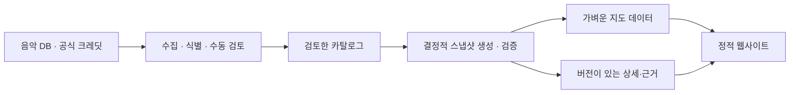

# K-HIPHOP MAP · 한국힙합지도

[한국어](README.md) · [English](README.en.md)

**곡으로 연결된 한국 힙합을 탐험하세요.**

1995년부터 수집 기준일까지의 녹음 크레딧으로 아티스트들이 함께 만든 음악과 그 연결을 살펴보는 비영리 웹 아카이브입니다.

[지도 열기](https://k-hiphop-map.vercel.app/) · [앨범 탐색](https://k-hiphop-map.vercel.app/releases/) · [수집 현황](https://k-hiphop-map.vercel.app/coverage/) · [제작 원칙](https://k-hiphop-map.vercel.app/methodology/) · [출처와 크레딧](https://k-hiphop-map.vercel.app/credits/) · [데이터 정정](https://github.com/taehyeonglim/k-hiphop-map/issues/new?template=data-correction.yml)

[](https://github.com/taehyeonglim/k-hiphop-map/actions/workflows/verify.yml)


<p align="center"> </p>

실제 서비스 화면입니다. 사진의 저작자·이용조건은 [크레딧](https://k-hiphop-map.vercel.app/credits/)에 있습니다.

2026-10-04 재조사로 남아 있던 핵심 107명의 사진을 모두 반영했습니다. 핵심 아티스트 사진은 **268/268명(100%)**, 전체는 **781/2,756명**입니다. 이번 107장은 공개 프로필·인터뷰 출처를 대조한 사진이며, **개별 재사용 허락은 미확인**으로 별도 표시합니다. [추가 사진·선택 근거·재현 방법](docs/portrait-expansion.md)

## 이런 탐색을 할 수 있어요

- **좋아하는 아티스트의 협업자 찾기:** [가리온에서 시작하기](https://k-hiphop-map.vercel.app/?artist=garion).
- **특정 시기의 장면 보기:** [2005–2014년의 협업 지도](https://k-hiphop-map.vercel.app/?from=2005&to=2014).
- **두 아티스트의 연결 찾기:** 아티스트 상세의 ‘다른 아티스트와 연결 찾기’에서 각 구간의 근거 곡까지 확인합니다.
- **초기 음반 찾기:** [대한민국·Master Plan·BLEX 등 앨범 탐색](https://k-hiphop-map.vercel.app/releases/)에서 제목·연도·유형·레이블로 찾고 전체 수록 순서와 곡별 출처를 확인합니다.
- **누락 자료 확인:** [수집 현황](https://k-hiphop-map.vercel.app/coverage/)에서 전체 아티스트의 사진 조사 상태와 추가 확인이 필요한 음반을 봅니다.

## 사용법

1. 한글·영문 이름이나 활동명으로 검색합니다. 방향키와 Enter로도 선택할 수 있습니다.
2. 얼굴을 선택하면 직접 협업한 아티스트와 연결선이 표시됩니다.
3. 협업자 옆 곡 수나 연결선을 눌러 공동 작업곡을 확인하고 ‘크레딧 근거’를 펼칩니다.
4. 기간·최소 곡 수·협업자 확장으로 범위를 바꿉니다. ‘전체 네트워크 보기’는 선택만 해제합니다.
5. ‘공유’로 현재 기간·아티스트·경로·목록 상태를 전달합니다. 뒤로 가기로 이전 선택에 돌아갈 수 있습니다.

모바일 검색창은 항상 보이며 상세는 ‘상세 펼치기’로 읽습니다. 지도 사용이 어려운 환경에서는 목록으로 같은 아티스트와 협업곡을 탐색할 수 있습니다. 30초 소개 영상은 버튼을 누를 때만 재생하고, 그 전에는 영상 파일을 다운로드하지 않습니다.

## 지도를 읽는 법

| 표시 | 의미 |
| --- | --- |
| 얼굴 크기 | 선택 기간의 협업자 수 |
| 선 굵기 | 같은 녹음에 랩·가창으로 함께 참여한 고유 곡 수의 로그 척도 |
| 색 | 협업 구조의 군집. 실제 레이블·크루를 뜻하지 않음 |
| 거리 | 협업 가중치에 따른 배치. 친분·음악적 유사성의 점수가 아님 |

최초 발매 연도로 기간을 구분하고 같은 녹음의 재발매는 한 번만 셉니다. 그룹은 개인 멤버와 별도이며 그룹 작업을 멤버 개인의 협업으로 추정하지 않습니다. 역할·인물이 불명확한 크레딧은 승인된 연결에서 제외합니다. 표시 수치는 **수집한 증거의 범위**이며 한국 힙합 전체나 완전한 디스코그래피를 의미하지 않습니다. 발매 음원과 가사는 제공하지 않으며 듣기는 외부 서비스로 연결합니다.

## 기술과 데이터 흐름

Next.js 정적 export · React · TypeScript · Sigma/WebGL · Graphology · ForceAtlas2 · weighted Louvain · Vitest · Playwright



지도에 필요한 자료를 먼저 가져오고 아티스트·곡의 상세 근거는 선택할 때 가져옵니다. 자료 버전이 다르면 새로고침을 안내합니다. [구조·타입·URL 계약](docs/architecture.md)을 참고하세요.

## 로컬 실행

**Node.js 22+**가 필요합니다. 저장소에 검토된 카탈로그와 사진이 포함되어 있어 일반 실행에 Python, API 키, 음악 서비스 로그인이 필요하지 않습니다.

```sh
npm ci
npm run data:build
npm run dev
```

[localhost:3000](http://localhost:3000)을 엽니다. 선택 설정은 [.env.example](.env.example)에 있습니다. 데이터 수집·사진 처리·영상 재생성에는 별도 Python 의존성이 필요합니다.

## 검증·빌드·배포

```sh
npm run typecheck
npm test
npm run api:check
python3 scripts/test-collector.py
python3 -m pip install -r requirements.txt
python3 scripts/test-portraits.py
npm run build
npm start -- --listen 3100
# 다른 터미널에서 빌드 결과 검증
PLAYWRIGHT_BASE_URL=http://127.0.0.1:3100 npm run test:e2e
```

`npm run build`의 prebuild가 스냅샷 생성과 출시 검증을 수행합니다. 결과물은 `out/`입니다. 일반 로컬 서버에는 별도 방문자 API가 없으므로 방문 수는 `—`로 표시될 수 있습니다. 브라우저 테스트에서는 API를 모의 응답으로 검증합니다.

출시 검증은 핵심 아티스트 150명 이상, 시대별 근거 곡, 고유 ID, 크레딧 출처, 사진의 로컬 파일·귀속 정보와 연결선의 녹음 근거를 확인합니다. 테스트는 설치된 Google Chrome 또는 `npx playwright install chromium`으로 설치한 Chromium을 사용합니다. 네이티브 GPU 성능 검사는 개발 서버에서 `npm run test:performance`로 별도 실행합니다.

[배포·방문자 API·복구 절차](docs/operations.md) · [검증 기록과 한계](docs/qa.md)

## 데이터 갱신

주간 수집 워크플로는 검토 후보를 만들며 자동으로 공개하지 않습니다. 인물·참여 역할·판본을 검토한 카탈로그만 커밋하여 공개합니다. 원본 카탈로그와 공식 정정 자료를 수정하고, 생성된 `public/data/`는 직접 수정하지 않습니다.

[초기 음반·사진 수집 계획과 반영 기록](docs/archive-collection.md) · [수집 명령과 검토 절차](docs/data-pipeline.md) · [데이터 감사](docs/data-audit.md) · [출처 검증](docs/source-verification.md)

## 오류 제보와 기여

[화면·기능 오류](https://github.com/taehyeonglim/k-hiphop-map/issues/new?template=bug.yml)에는 재현 URL·순서·브라우저를, [데이터 정정](https://github.com/taehyeonglim/k-hiphop-map/issues/new?template=data-correction.yml)에는 아티스트·곡·수정 내용·검증 가능한 출처 URL을 적어 주세요.

[기여 안내](CONTRIBUTING.md)를 확인하세요. 사용자에게 보이는 동작이 바뀌면 한국어·영어 README를 함께 갱신합니다.

## 라이선스와 출처

코드는 [MIT](LICENSE)입니다. 코드 라이선스는 데이터·사진·음악·폰트를 재라이선스하지 않습니다.

- [MusicBrainz 핵심 메타데이터](https://musicbrainz.org/doc/About/Data_License)는 CC0이며 부가 태그·장르 정보는 CC BY-NC-SA 3.0입니다. 캐시된 프로필과 파생 자료에도 해당 조건을 구분해 적용합니다.
- maniadb 유래 데이터는 CC BY-NC-SA 2.0 KR 조건을 유지합니다.
- 사진마다 원본·출처 귀속·권리 상태·변형 내역을 기록합니다. 저작자 미표기 및 재사용 허락 미확인 사진은 명시된 CC 라이선스 사진과 구분하며, 출처 표기 자체가 이용허락을 뜻하지 않습니다. [사진 감사](docs/image-audit.md)
- Anton, Barlow Condensed, Noto Sans KR의 OFL 고지문은 `public/fonts/`에 있습니다.
- 소개 영상의 오리지널 연주곡은 임태형 a.k.a. Lyricist가 이 프로젝트를 위해 제작했습니다. 사진·데이터·폰트의 이용조건은 영상에서도 별도로 유지합니다. [영상 제작·재현 안내](docs/trailer.md)

## 로드맵과 제작자

앨범 중심의 초기 자료 수집, 전체 트랙 목록, 곡별 역할 검토, 한자·활동명 검색, 모든 아티스트의 사진 조사 기록을 추가했습니다. 사진 조사 완료는 모든 사진을 확보했다는 뜻이 아니며, 인물·이용조건이 확인되지 않은 항목은 사유와 다음 조사 행동을 공개합니다. 다음 검증 과제는 실제 iOS·Android 기기 측정과 사용자 5명의 과제 수행 점검입니다. 완료 여부는 [QA 기록](docs/qa.md)에 구분해 기록합니다.

제작: [임태형 a.k.a. Lyricist](https://github.com/taehyeonglim)
